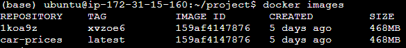
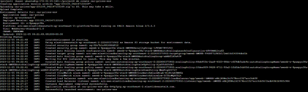
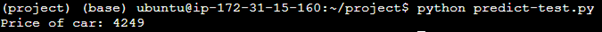
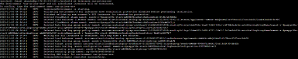

**Cloud Deployment to AWS Elastic Beanstalk**

Will use docker **car-prices** container created previously

List docker containers to see that it is available:

`docker images`

Create Elastic Beanstalk environment:
`create car-prices-env`

This creates an Elastic Bean application that is available at:  
`car-prices-env.eba-6vtp3yrg.ap-southeast-2.elasticbeanstalk.com`

Create the car-prices application running on the Elastic Bean application:  
`eb init -p "Docker running on 64bit Amazon Linux 2" -r ap-southeast-2 car-prices-env.eba-6vtp3yrg.ap-southeast-2.elasticbeanstalk.com`

Now we can test the application by running:  
`python predict-test.py`

This returns the price of the car so we can see it is working!

You can can see the code for [predict-test.py](https://github.com/BuzzKanga/MLZoomcamp-2023-Mid-Term-Project/blob/main/predict-test.py)

Now we need to terminate our Elastic Bean environment:  
`eb terminate car-prices-env`

