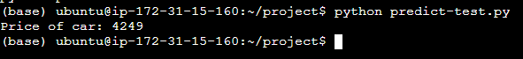

# Reproduce Project

### Pre-requisites

The following are assumed to be available and running in a Unix environment:

- python

- git

- docker
  
  

The steps to reproduce the project are listed below:

### 1. Clone the repo

Command to clone the project repo

```
git clone https://github.com/BuzzKanga/MLZoomcamp-2023-Mid-Term-Project.git
```

### 2. Build a docker image

To build a docker container the following [Dockerfile](https://github.com/BuzzKanga/MLZoomcamp-2023-Mid-Term-Project/blob/main/Dockerfile) will be used.

The command to build a docker container call **car-prices** with the model in it is:

`docker buildx build -t car-prices .`

### 3. Run docker image

The command to run the docker file and bind it ito port 9696 is:

`docker run -it --rm -p 9696:9696 car-prices`

### 4. Test the model

To test the model, run the [predict-test.py](https://github.com/BuzzKanga/MLZoomcamp-2023-Mid-Term-Project/blob/main/predict-test.py) python program as follows:

`python predict-test.py`

This will return the car price as 4249




